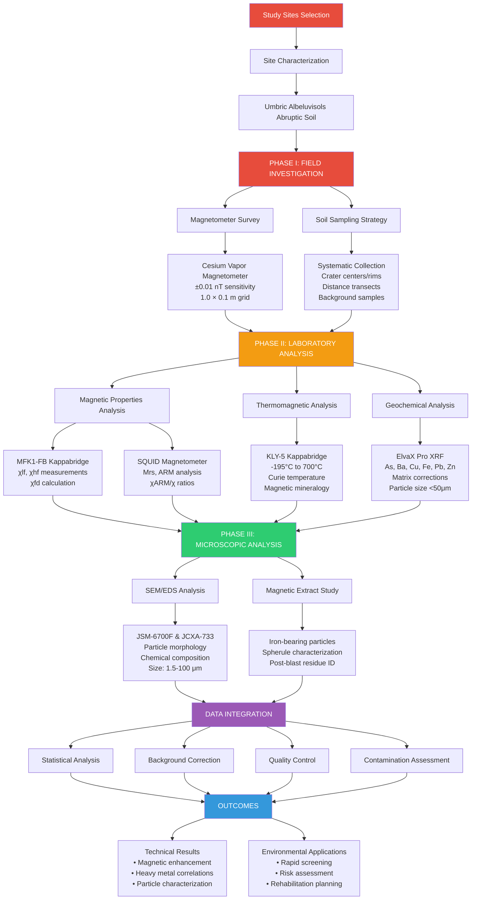
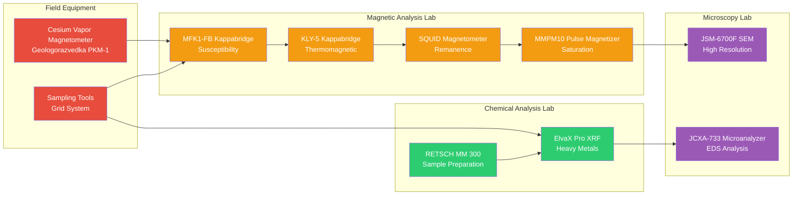

# Methodological Scheme Flowchart

## Interactive HTML Visualization
The main visual representation is available in `Methodological_Scheme_Visualization.html`

## Simplified Flowchart (Mermaid Format)

## Key Equipment Network

## Analysis Flow by Parameter Type

```mermaid
flowchart TB
    subgraph "Magnetic Parameters"
        M1[χ - Magnetic Susceptibility]
        M2[χfd - Frequency Dependence]
        M3[Mrs - Saturation Remanence]
        M4[ARM - Anhysteretic Remanence]
        M5[S300 - Hard/Soft Ratio]
        M6[Curie Temperature]
    end
    
    subgraph "Chemical Parameters"
        C1[As - Arsenic]
        C2[Ba - Barium]
        C3[Cu - Copper]
        C4[Fe - Iron]
        C5[Pb - Lead]
        C6[Zn - Zinc]
    end
    
    subgraph "Physical Parameters"
        P1[Particle Size]
        P2[Morphology]
        P3[Spatial Distribution]
        P4[Grain Size]
    end
    
    M1 --> CORR[Correlation Analysis]
    M2 --> CORR
    M3 --> CORR
    M4 --> CORR
    M5 --> CORR
    M6 --> CORR
    
    C1 --> CORR
    C2 --> CORR
    C3 --> CORR
    C4 --> CORR
    C5 --> CORR
    C6 --> CORR
    
    P1 --> CORR
    P2 --> CORR
    P3 --> CORR
    P4 --> CORR
    
    CORR --> RESULT[Integrated Assessment<br/>Contamination Mapping<br/>Source Identification]
    
    style CORR fill:#e67e22,color:#fff
    style RESULT fill:#8e44ad,color:#fff
```

